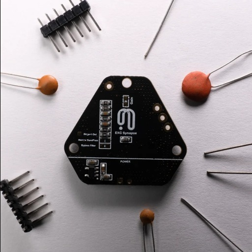
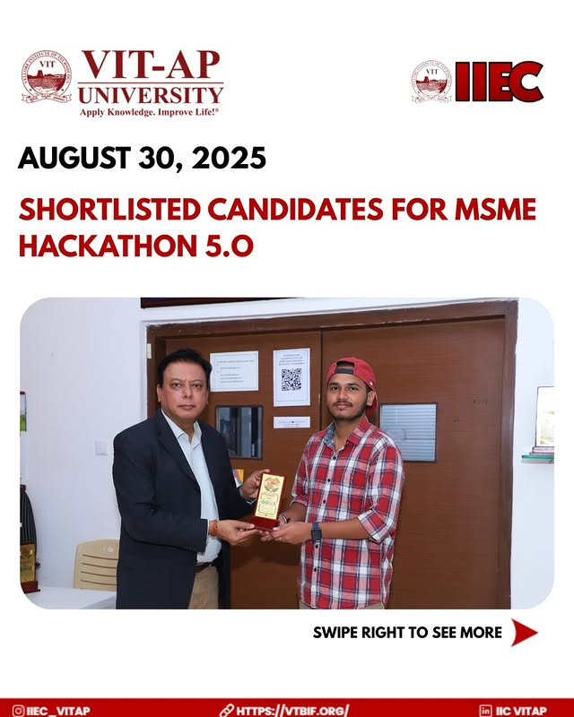

# POTECH
### Brain-Computer Interface Solutions & Neural Technology

## Overview

**POTECH** is an innovative Brain-Computer Interface (BCI) project that makes advanced neurotechnology accessible outside expensive laboratories. Our solution captures EEG signals using affordable sensors and converts them into real-time commands, enabling direct interaction between humans and machines.
## Key Features

- **Accessible NeuroTech** - EEG capture using affordable sensors for students, researchers, and innovators
- **Real-Time Interaction** - Direct device control through neural and muscular activity
- **Practical Applications** - Healthcare, education, and daily life integration
- **Sustainable Innovation** - Recognized under Low Carbon Emission category by MSME

## Demo Video

Watch our prototype demonstration showcasing the BCI technology in action:

## Project Images

*Brain-Computer Interface Technology*

*MSME Shortlisted Project*

*Technical Implementation*

## 👥 Team

Our multidisciplinary team combines creativity, research, and innovation:

| Name | Role | Specialization |
|------|------|----------------|
| **Sharath Schandra Kolli** | Hardware Engineer | EEG sensors, circuits, real-time signal capture |
| **Nishkarsh Hublikar** | UI/UX Designer | User-friendly interface design |
| **Krishna Nand Jha** | Market Analyst | Applications, market needs, feasibility |
| **Nithin Jambula** | Hardware Engineer | EEG sensors, circuits, real-time signal capture |
| **Sarayu Togar** | Research Analyst | Existing BCI research and development insights |
| **Sai Sandeep** | Market Analyst | Applications, market needs, feasibility |

## 🌐 Live Website

Visit our project website: [https://nishkarshhublikar.github.io/potech_bci/](https://nishkarshhublikar.github.io/potech_bci/)

## Recognition

- **MSME Shortlisted** - Recognized under Low Carbon Emission category
- Commitment to sustainable and eco-friendly innovation

---

<strong>Mind Meets Machine: User-Friendly Brain-Computer Interface</strong>

